# Proyecto final

En este proyecto, asumirá el rol de un desarrollador back-end que trabaja para un minorista en línea que vende libros. Se le ha asignado la tarea de desarrollar una aplicación del lado del servidor que almacene, recupere y administre calificaciones y reseñas de libros.

Su aplicación del lado del servidor debe proporcionar las siguientes características y capacidades para permitir a los usuarios:

- Recuperar una lista de todos los libros disponibles en la librería

- Buscar libros específicos y recuperar sus detalles según el código ISBN del libro, los nombres de los autores y los títulos

- Recuperar reseñas/comentarios de libros específicos

- Registrarse como un nuevo usuario de la aplicación

- Iniciar sesión en la aplicación

- Agregar una nueva reseña de un libro (solo usuarios registrados)

- Modificar una reseña de un libro (los usuarios registrados pueden modificar solo sus propias reseñas)

- Eliminar una reseña de un libro (los usuarios registrados pueden eliminar solo sus propias reseñas)

- (Varios usuarios) Acceder a la aplicación al mismo tiempo para ver y administrar diferentes reseñas de libros simultáneamente

Como sucede con la mayoría de los proyectos de desarrollo de software, diferentes personas en el equipo trabajan en diferentes partes de la aplicación. Otro desarrollador front-end de su equipo está trabajando en la aplicación del lado del cliente basada en la web que se comunicará con su aplicación del lado del servidor mediante REST. Por lo tanto, su trabajo es implementar su aplicación del lado del servidor como un servicio web RESTful. Un arquitecto de software de su equipo ha escrito el código esqueleto para su aplicación del lado del servidor utilizando Node.js y Express.js.

Para completar el proyecto, bifurcará el código esqueleto en su propio repositorio, lo clonará localmente en su entorno de desarrollo y desarrollará el código aún más para implementar las capacidades CRUD enumeradas anteriormente como métodos HTTP en su servidor Express y las probará utilizando Postman (localmente Insomnia). También implementará la autenticación de sesión y JWT para permitir que solo los usuarios registrados realicen ciertas operaciones. Para su referencia, esta aplicación viene precargada con toda la información del libro.

Además, deberá mejorar su código utilizando promesas, devoluciones de llamadas o funciones Async/Await para permitir que varios usuarios interactúen con la aplicación simultáneamente y no tengan que esperar a que se completen las operaciones de los demás.

## Criterios de evaluación: 30 puntos en total

Tome las capturas de pantalla correspondientes a cada tarea en particular para su revisión por pares, como se menciona en las instrucciones del laboratorio. Sus compañeros que también estén completando el curso durante la misma sesión calificarán este proyecto. Este proyecto suma 30 puntos para su calificación final y se pondera de la siguiente manera:

### Usuarios generales:

Tarea 1: Obtenga la lista de libros disponible en la tienda. - 2 puntos

Tarea 2: Obtenga los libros según el ISBN. - 2 puntos

Tarea 3: Obtenga todos los libros por autor. - 2 puntos

Tarea 4: Obtenga todos los libros según el título. - 2 puntos

Tarea 5: Obtenga la reseña del libro. - 2 puntos

Tarea 6: Registrar un nuevo usuario. - 3 puntos

Tarea 7: Inicie sesión como usuario registrado. - 3 puntos

### Usuarios registrados:

Tarea 8: Agregar o modificar una reseña de un libro. - 2 puntos

Tarea 9: Eliminar la reseña de un libro agregada por ese usuario en particular - 2 puntos

### Programa Node.JS con 4 métodos (Usar Async/Await o Promises con Axios en Node.js para los cuatro métodos.):

Tarea 10: Obtener todos los libros – Utilizar la función de devolución de llamada asincrónica – 2 puntos

Tarea 11: Buscar por ISBN – Utilizar Promises – 2 puntos

Tarea 12: Buscar por autor – 2 puntos

Tarea 13: Buscar por título – 2 puntos

Tarea 14: Envío del enlace de GitHub del proyecto – 2 puntos

### Siguientes pasos

Asegúrese de leer la descripción general antes de comenzar con las instrucciones paso a paso.

# Desglose del proyecto

Este proyecto final de este curso consta de varios pasos que debes completar. Para darte una visión general del proyecto, a continuación se enumeran todos los pasos de alto nivel. El proyecto se divide en varias tareas que brindan instrucciones detalladas para cada paso. Debes completar todas las tareas para completar el proyecto con éxito.

## Requisito previo: Debe completar los siguientes dos laboratorios antes de comenzar el proyecto final.

1. Laboratorio práctico: operaciones CRUD con Node.js.

2. Proyecto práctico: operaciones CRUD en el servidor Express con JWT y autenticación de sesión.

## Parte A: Bifurca el repositorio Git para tener el código de la aplicación de revisión de libros del lado del servidor que necesitas para comenzar

1. Crea tu propia copia del repositorio git que contiene el código que necesitas para iniciar el proyecto.

2. Clona el repositorio en el entorno de Theia.

## Parte B: npm instala los paquetes necesarios e inicia sesión en Postman, para este caso se usará Insomnia

1. Cambie al directorio del servidor Express JS e instale todos los paquetes necesarios en su entorno local para que el servidor funcione.

2. Use sus credenciales de correo de Google para registrarse o iniciar sesión con Postman y probar los puntos finales de la API para su proyecto final.

## Parte C: Implementación de la autenticación para utilizar la aplicación Book Review

1. Creará restricciones de acceso a algunos puntos finales mediante JWT y autenticación a nivel de sesión.

## Parte D: Acceda a la aplicación de revisión de libros como usuario de propósito general y registre al usuario

1. El usuario general puede acceder a todos los libros disponibles en la tienda y obtener todos los libros según ISBN, autor, título y reseña.

2. Una vez que un usuario se registra en la aplicación, puede agregar, modificar y eliminar reseñas de libros.

## Parte E: Use Async/Await o Promises con Axios en Node.js para cada una de las cuatro operaciones CRUD.

1. Con la función async,callback, recupera todos los libros. Con Promises, busca el libro por ISBN y luego por autor o título.

2. Ahora prueba los puntos finales de la API con Postman, en este caso Insomnia.

## Envíe su proyecto para calificación

- Para que lo califiquen, envíe la URL de Github del código de su aplicación de revisión de libros.

- En este laboratorio, se le solicitará que tome las capturas de pantalla necesarias, similares a una muestra proporcionada, y que le asigne un nombre específico.

- Asegúrese de usar el nombre especificado, ya que la persona que revise su laboratorio podrá identificar la captura de pantalla correcta en función de eso y revisarla en consecuencia.

# Proyecto Final - Solicitud de Reseña de Libros

En este proyecto final, crearemos una aplicación de revisión de libros en línea del lado del servidor y la integraremos con un servidor API REST seguro que utilizará autenticación a nivel de sesión mediante JWT. Luego, probará su aplicación utilizando devoluciones de llamadas de Promises o funciones Async-Await.

## Objetivos

1. Cree API y realice operaciones CRUD en un servidor Express mediante autenticación de sesión y JWT.

2. Utilice Async/Await o Promises con Axios en Node.js.

3. Cree puntos finales de API REST y pruébelos con Postman, en este caso Insomnia.

## Configuración: Crear aplicación

1. Abrir una nueva terminal

2. Cambie a la carpeta de su proyecto, si aún no se encuentra en ella.

`cd /home/project`

3. Bifurque el repositorio Git que contiene el código de inicio necesario para este laboratorio:

`https://github.com/ibm-developer-skills-network/expressBookReviews.git`

4. Clona tu repositorio Git bifurcado, si aún no existe.

`[ ! -d 'expressBookReviews' ] && git clone https://github.com/<your Github username>/expressBookReviews.git`

Para mi caso

`git clone https://github.com/Kevin-Jimenez-D/expressBookReviews.git`

5. Cambiar el directorio para empezar a trabajar

`cd final_project/`

6. Y listar los contenidos

`ls`

## Comprender la aplicación del servidor

Ver el código index.js.

Los paquetes necesarios para este proyecto como las dependencias estan en packages.json, por lo menos debe tener lo siguiente:

```JSON
  "dependencies": {
    "express": "^4.18.1",
    "express-session": "^1.17.3",
    "jsonwebtoken": "^8.5.1",
    "nodemon": "^2.0.19"
}
```

## Comprender las rutas de usuario

Navegar en la carpeta router que tendra 3 archivos:

1. `booksdb.js` Aquí se incluye la información del libro precargado para esta aplicación.

2. `general.js` Esto contiene las implementaciones esqueléticas de las rutas a las que un usuario general puede acceder.

3. `auth_users.js` Esto contiene las implementaciones esqueléticas de las rutas a las que un usuario autorizado puede acceder.

## Empezar a correr el servidor

Antes recordar de que se debe estar en otra ruta

`cd final_project/`

Ejecute npm install para instalar los módulos necesarios e iniciar el servidor.

`npm install`

Y luego hacer correr el archivo index.js, con esto debe aparecer que el servidor esta corriendo

`node index.js`

## Actualización del código para el mecanismo de autenticación:

- Navegar a `index.js` y actualizar el código de autenticación abajo `app.use("/customer/auth/*", function auth(req,res,next){`

Sugerencia: utilice la función de autorización de sesión (implementada en el laboratorio del proyecto de práctica) para autenticar a un usuario según el token de acceso.

Para validar los funtos finales, se usará Insomnia, es descargarlo para sus sistema operativo

`https://insomnia.rest/download`

Registrarse, y lo primero es crear una nueva colección para este proyecto en Insomnia

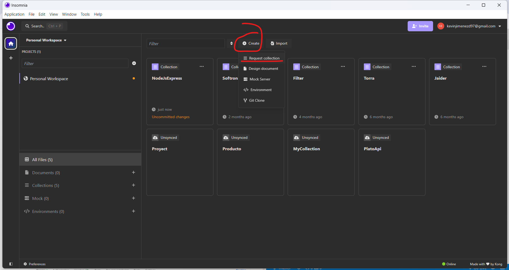

Y además, un nuevo método HTTp

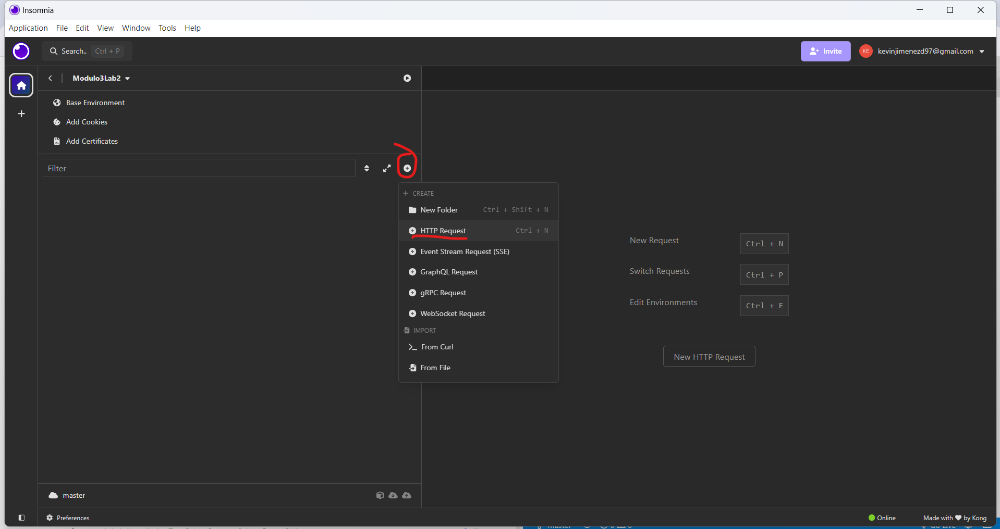

Enviar una solicitud POST en el punto final, utilizando los siguientes parámetros JSON en el "cuerpo" de la solicitud.

`http://localhost:5000/customer/auth/`

Seleccione 'Body' >> >> 'JSON' y pase los parámetros.

```JSON
{"username":"user2", "password":"password2"}
```

Debería devolver el resultado como {"mensaje": "Usuario registrado correctamente. Ahora puede iniciar sesión"}

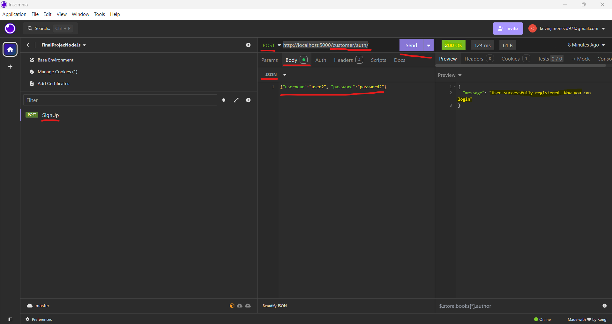

## Actualizar y probar las rutas generales de usuario

En general.js

Notas

- Recuerda enviar tu trabajo al repositorio de GitHub después de completar cada tarea o si no estás completando el laboratorio en una sola sesión. Puedes encontrar los pasos para enviar el repositorio a GitHub en la Tarea 14. Esto te ayudará a evitar perder tu progreso.

- Si tienes dificultades al usar Postman, puedes usar comandos curl para probar los puntos finales de la API, como se muestra en el Módulo 3: Laboratorio práctico: Operaciones CRUD con Node.js y Express. Proporciona capturas de pantalla que muestren la salida JSON de tus comandos curl en tu envío para revisión por pares. Para este caso se usará Insomnia como una forma alternativa

### Tarea 1

Completa el código para obtener el listado de libros disponibles en la tienda en `public_users.get('/',function (req, res) {`

Sugerencia: utilice el método JSON.stringify para mostrar la salida de forma ordenada.

Si algo cerrar los servidores anteriores con CTRL+C, y luego en general.js hacer los cambios, despues de hacerlos de nuevo ejecutar

`node index.js`

Ir a la siguiente ruta para ver todos los libros disponibles

`http://localhost:5000/`

Tome una captura de pantalla del mismo y guárdela con el nombre `1-getallbooks.png` para enviarla en la Tarea 1 de la Tarea de revisión por pares.

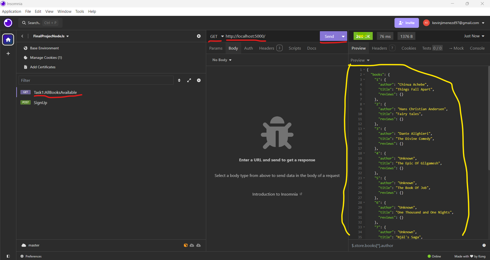

### Tarea 2:

Complete el código para obtener los detalles del libro según el ISBN en `public_users.get('/isbn/:isbn',function (req, res) {`

Sugerencia: Recupere el ISBN de los parámetros de la solicitud

Ir a la siguiente ruta para ver el libro disponible de acuerdo al isbn=1

`http://localhost:5000/isbn/1`

Tome una captura de pantalla del mismo y guárdela con el nombre `2-gedetailsISBN.png` para enviarla en la Tarea 2 de la Tarea de revisión por pares.

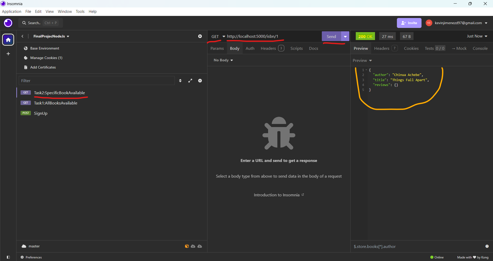

### Tarea 3:

Complete el código para obtener los detalles del libro según el autor a continuación `public_users.get('/author/:author',function (req, res) {`

Consejos:

1. Obtenga todas las claves para el objeto "libros".

2. Recorra la matriz "libros" y verifique que el autor coincida con el proporcionado en los parámetros de la solicitud.

Ir a la siguiente ruta para ver los detalles del libro según el autor a continuación, en este caso los desconocidos

`http://localhost:5000/author/Unknown`

Tome una captura de pantalla del mismo y guárdela con el nombre `3-getbooksbyauthor.png` para enviarla en la Tarea 3 de la Tarea de revisión por pares.

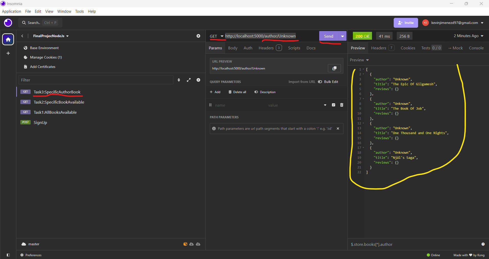

Ir a la siguiente ruta para ver los detalles del libro según el autor a continuación, en este caso el autor "Chinua Achebe", como este tiene un espacio, los espacios en las urls son con "%20", entonces para buscar ese autor es

`http://localhost:5000/author/Chinua%20Achebe`

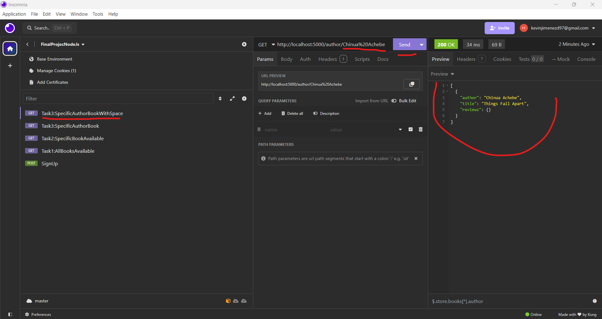

### Tarea 4:

Complete el código para obtener los detalles del libro según el título a continuación `public_users.get('/title/:title',function (req, res) {`

Ir a la siguiente ruta para ver los detalles del libro según el titulo a continuación, en este caso el autor "Fairy tales", como este tiene un espacio, los espacios en las urls son con "%20", entonces para buscar ese autor es

`http://localhost:5000/title/Fairy%20tales`

Tome una captura de pantalla del mismo y guárdela con el nombre `4-getbooksbytitle.png` para enviarla en la Tarea 4 de la Tarea de revisión por pares.

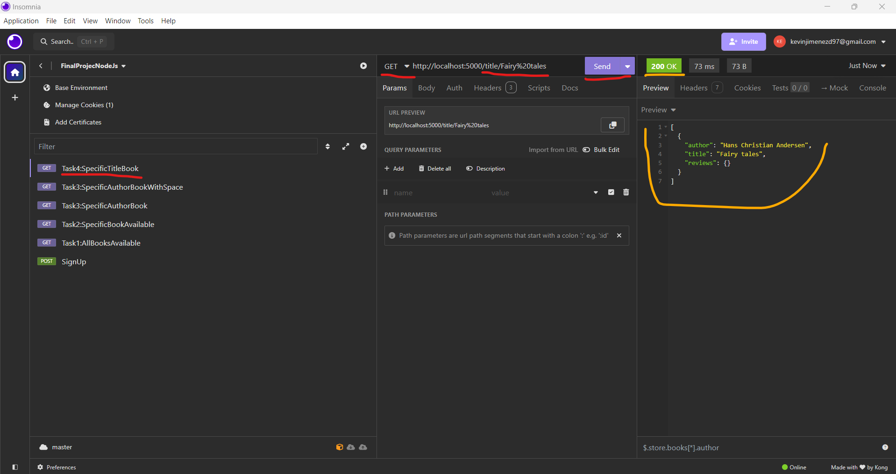

### Tarea 5:

Complete el código para obtener reseñas de libros en `public_users.get('/review/:isbn',function (req, res) {`

Sugerencia: Obtenga las reseñas de libros según el ISBN proporcionado en los parámetros de solicitud.

Ir a la siguiente ruta para ver el libro disponible de acuerdo al isbn=1

`http://localhost:5000/review/1`

Tome una captura de pantalla del mismo y guárdela con el nombre `5-getbookreview.png` para enviarla en la Tarea 5 de la Tarea de revisión por pares.

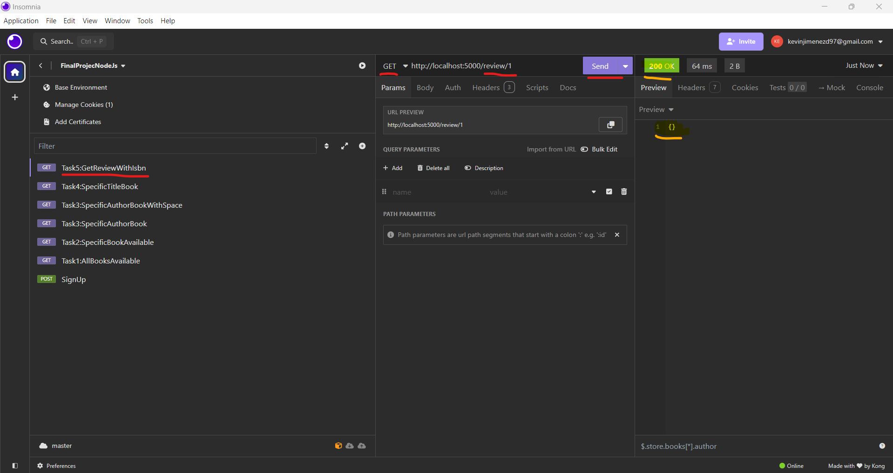


### Tarea 6:

Completa el código para registrar un nuevo usuario

Sugerencia: El código debe incluir el nombre de usuario y la contraseña que se proporcionan en el cuerpo de la solicitud de registro. Si el nombre de usuario ya existe, debe mencionarlo y también debe mostrar otros errores, como cuando no se proporcionan el nombre de usuario y la contraseña.

Enviar una solicitud POST en el punto final, utilizando los siguientes parámetros JSON en el "cuerpo" de la solicitud.

`http://localhost:5000/register`

Seleccione 'Body' >> >> 'JSON' y pase los parámetros.

```JSON
{"username":"user2", "password":"password2"}
```

Debería devolver el resultado como {"mensaje": "Usuario registrado correctamente. Ahora puede iniciar sesión"}

Tome una captura de pantalla del mismo y guárdela con el nombre `6-register.png` para enviarla en la Tarea 6 de la Tarea de revisión por pares.

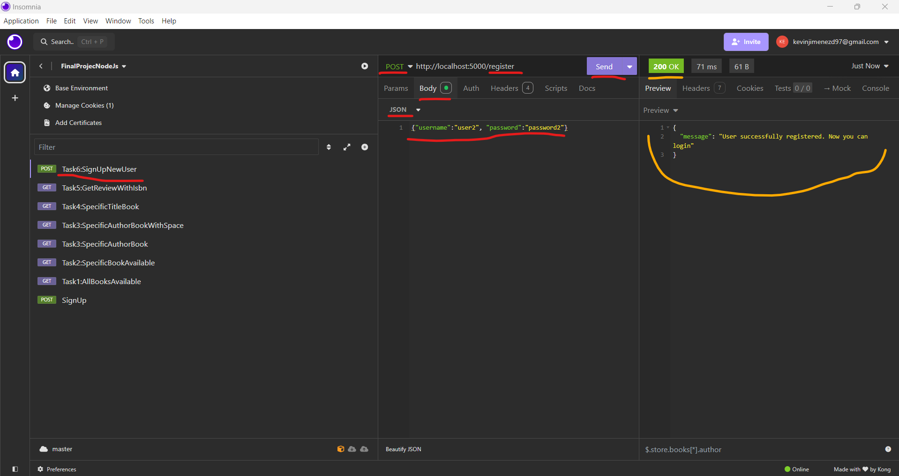

#### Los errores:

Si ya hay un usuario registrado, devuelve que este ya existe

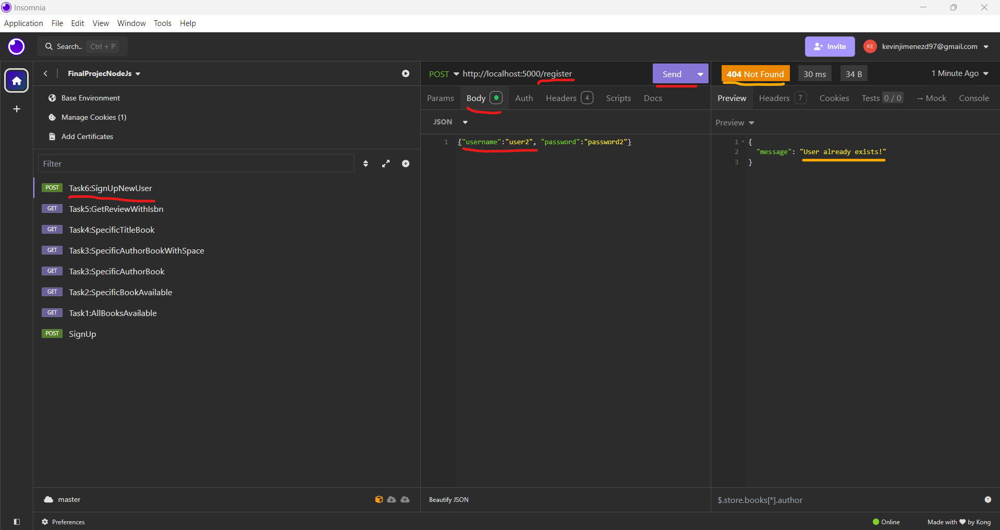

Y si no se digitan usuario o contraseña, devuelve que no se puede registrar

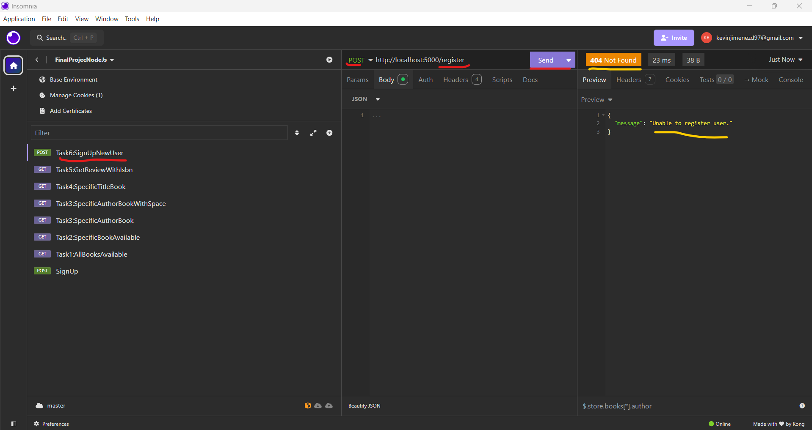